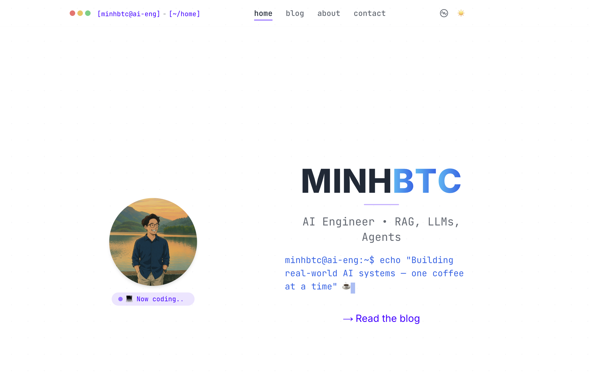

# MinhBTC Blog

A modern markdown blog with beautiful UI and smooth animations, featuring a dual-themed interface (light/dark mode), responsive design, and code snippet syntax highlighting.



## 🚀 Features

- 🎨 **Beautiful UI with Emerald/Teal Theme**: Elegant, modern interface with smooth transitions
- 🌓 **Light/Dark Mode**: Seamless theme switching with consistent design
- 📱 **Fully Responsive**: Optimized for all devices from mobile to desktop
- ✨ **Smooth Animations**: Elegant transitions and micro-interactions using Framer Motion
- 📝 **Markdown/MDX Support**: Write content in Markdown with rich MDX features
- 🔍 **Full-Text Search**: Fast content search across all blog posts
- 🏷️ **Tag System**: Organized content with customizable tags
- 🧩 **Component Showcase**: Demo page featuring all UI components
- 🖥️ **Terminal-Inspired Home**: Creative terminal-like landing page
- 📊 **Multiple View Modes**: List and shell view for blog posts
- 🔗 **Social Integration**: GitHub, LinkedIn, and Buy Me a Coffee links

## 🛠️ Tech Stack

- **Framework**: [Next.js 14](https://nextjs.org/)
- **Language**: [TypeScript](https://www.typescriptlang.org/)
- **Styling**: [TailwindCSS](https://tailwindcss.com/) with [DaisyUI](https://daisyui.com/)
- **Animations**: [Framer Motion](https://www.framer.com/motion/)
- **Content**: [MDX](https://mdxjs.com/) with [next-mdx-remote](https://github.com/hashicorp/next-mdx-remote)
- **Icons**: [Lucide React](https://lucide.dev/guide/packages/lucide-react) and [SimpleIcons](https://github.com/simple-icons/simple-icons)
- **Theming**: [next-themes](https://github.com/pacocoursey/next-themes)
- **Deployment**: Vercel/Docker ready

## 📦 Installation

### Prerequisites

- Node.js 20+
- Yarn or npm

### Setup

1. Clone the repository
   ```bash
   git clone https://github.com/minhbtc/blogUI.git
   cd blogUI
   ```

2. Install dependencies
   ```bash
   yarn install
   # or
   npm install
   ```

3. Create a `.env` file by copying `.env.example`
   ```bash
   cp .env.example .env
   ```

4. Fill in the environment variables (see Environment Variables section)

5. Start the development server
   ```bash
   yarn dev
   # or
   npm run dev
   ```

6. Visit `http://localhost:3000` to see your blog

### Production Build

```bash
# Build the app
yarn build
# or
npm run build

# Start the production server
yarn start
# or
npm start
```

### Docker Deployment

The project includes a Dockerfile for containerized deployment:

```bash
# Build the Docker image
docker build -t minhbtc-blog .

# Run the container
docker run -p 3000:3000 minhbtc-blog
```

## 🔧 Environment Variables

Copy `.env.example` to `.env` and fill in the following variables:

| Variable | Description |
|----------|-------------|
| `NEXT_PUBLIC_HOST` | Your site URL (e.g., https://yourblog.com) |
| `NEXT_PUBLIC_SITE_NAME` | Name of your blog |
| `NEXT_PUBLIC_SITE_DESCRIPTION` | Short description for SEO |
| `NEXT_PUBLIC_SITE_FULL_DESCRIPTION` | Longer description used in metadata |
| `NEXT_PUBLIC_SITE_VERSION` | Version of your site |
| `NEXT_PUBLIC_AUTHOR_NAME` | Your name |
| `NEXT_PUBLIC_AUTHOR_ROLE` | Your professional role/title |
| `NEXT_PUBLIC_AUTHOR_LOCATION` | Your location |
| `NEXT_PUBLIC_AUTHOR_EMAIL` | Your email address |
| `NEXT_PUBLIC_COPYRIGHT_YEAR` | Year for copyright notice |
| `NEXT_PUBLIC_GITHUB_URL` | Your GitHub profile URL |
| `NEXT_PUBLIC_LINKEDIN_URL` | Your LinkedIn profile URL |
| `NEXT_PUBLIC_TWITTER_URL` | Your Twitter profile URL |
| `NEXT_PUBLIC_HUGGINGFACE_URL` | Your HuggingFace profile URL |
| `NEXT_PUBLIC_BUYMEACOFFEE_URL` | Your Buy Me a Coffee page URL |
| `NEXT_PUBLIC_BUYMEACOFFEE_ID` | Your Buy Me a Coffee ID |

## 📝 Adding Blog Posts

Add your Markdown/MDX blog posts to the `src/app/blog` directory. Each post should include YAML frontmatter with metadata:

```markdown
---
title: "Your Post Title"
description: "A brief description of your post"
date: "2023-08-01"
tags: ["tag1", "tag2"]
---

Your content here...
```

## 🎨 Customization

### Theme

The color scheme uses emerald/teal for light mode and blue for dark mode. You can customize these colors in:

- `src/app/globals.css`: For CSS variables
- `tailwind.config.js`: For Tailwind theme configuration

### Components

The project includes a component showcase at `/components` to help you see and customize all available UI elements.

## 🤝 Contributing

Contributions are welcome! Please feel free to submit a Pull Request.

1. Fork the repository
2. Create your feature branch (`git checkout -b feature/amazing-feature`)
3. Commit your changes (`git commit -m 'Add some amazing feature'`)
4. Push to the branch (`git push origin feature/amazing-feature`)
5. Open a Pull Request

## 📄 License

This project is licensed under the MIT License - see the LICENSE file for details.

## 👏 Acknowledgements

- Special thanks to the Next.js, React, and TailwindCSS teams
- Icons provided by Lucide and SimpleIcons
- Built with assistance from AI tools including GPT-4o and Cursor

---

Made with ❤️ by [MinhBTC](https://github.com/minhbtc)
